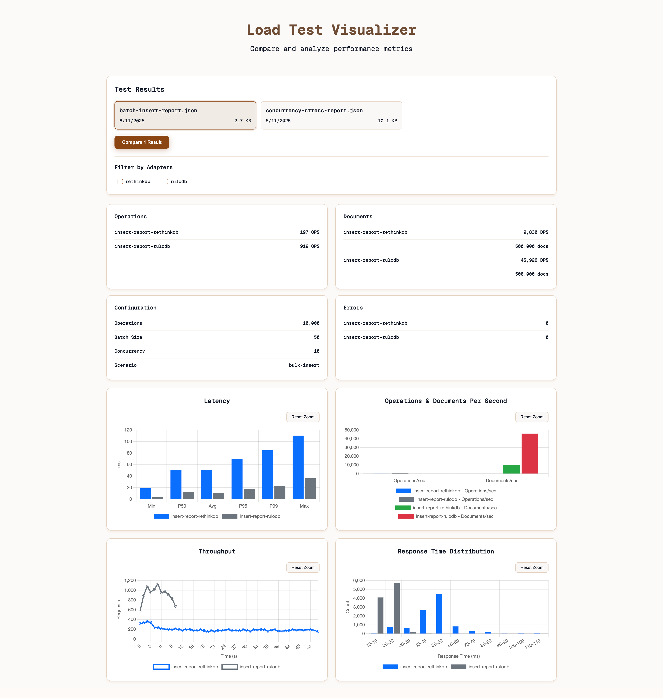

# RuloDB Load Tester

A comprehensive load testing suite for RuloDB and other database systems with a modern web dashboard for analyzing and comparing test results.

## Features

- **Multi-Adapter Support**: Test multiple database adapters (RethinkDB, etc.)
- **Flexible Execution**: Run single adapter, multiple adapters, or all available adapters
- **Modern Dashboard**: Web-based interface for visualizing and comparing test results
- **Comprehensive Metrics**: Latency distribution, throughput, QPS, error rates, and more
- **Result Comparison**: Side-by-side comparison of different test runs

## Quick Start

### Running Load Tests

```bash
# Install dependencies
bun install

# Run a basic test with RethinkDB
bun src/runner.ts --scenario basic-insert --adapter rulodb

# Run test with multiple adapters
bun src/runner.ts --scenario basic-insert --adapter rulodb,rethinkdb

# Run test with all available adapters for a scenario
bun src/runner.ts --scenario basic-insert

# Custom configuration
bun src/runner.ts --scenario basic-insert --requests 5000 --concurrency 50
```

### Viewing Results with Dashboard

```bash
# Start the dashboard server
bun run dashboard

# Open http://localhost:3000 in your browser
```

## Test Results

Results are automatically saved to the `results/` directory with descriptive filenames:

- Single adapter: `{scenario}-{adapter}-report.json`
- Multiple adapters: `{scenario}-all-report.json`
- Custom filename: `{custom-name}.json`

## Example Workflow

1. **Run Tests**:
   ```bash
   # Test RethinkDB
   bun src/runner.ts -s basic-insert -a rethinkdb -r 1000 -c 20
   
   # Test with different concurrency
   bun src/runner.ts -s basic-insert -a rethinkdb -r 1000 -c 50
   
   # Test all adapters
   bun src/runner.ts -s basic-insert -r 1000 -c 20
   ```

2. **Start Dashboard**:
   ```bash
   bun run dashboard
   ```

3. **Compare Results**:
   - Open http://localhost:3000
   - Select the test results you want to compare
   - Click "Compare Selected Results"
   - Analyze the performance differences

## Adding New Scenarios

Create a new scenario by extending the `Scenario` class:

```typescript
import { Scenario } from '../scenario';
import { DatabaseAdapter } from '../../adapters';

export class MyNewScenario extends Scenario {
  constructor() {
    super('my-scenario', new MyAdapter());
  }

  async setup(): Promise<void> {
    // Setup code
  }

  async test(): Promise<void> {
    // Test operation to be benchmarked
  }

  async teardown(): Promise<void> {
    // Cleanup code
  }

  async validate(): Promise<boolean> {
    // Validation logic
    return true;
  }
}
```

Then register it in `src/scenarios/index.ts`:

```typescript
export const scenarios = {
  'my-scenario': {
    [AdapterType.RETHINKDB]: new MyNewScenario()
  }
};
```

## Adding New Adapters

1. Create adapter class implementing `DatabaseAdapter` interface
2. Add to `src/adapters/index.ts`
3. Update `AdapterType` enum
4. Create scenarios for the new adapter

## Development

```bash
# Lint code
bun run lint

# Format code
bun run format

# Run dashboard in development
bun run dashboard
```

## Requirements

- Bun runtime
- Database systems you want to test (RethinkDB, etc.)
- Modern web browser for dashboard

## Screenshot

<div align="center">
  
</div>
